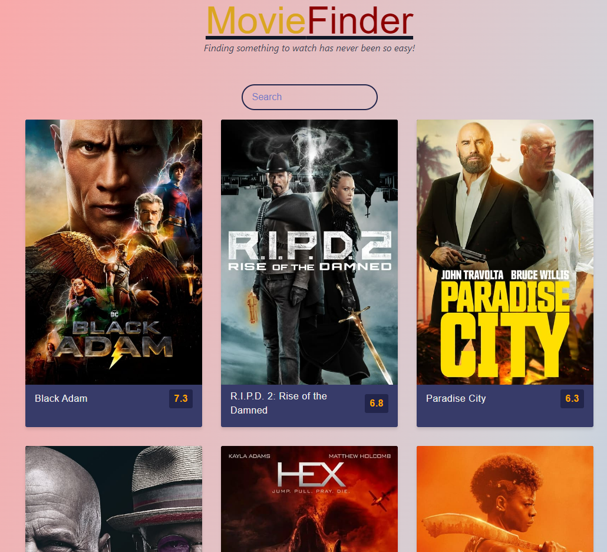

# MovieFinder

As a user when I search for a movie that I enjoyed, I want to have movies recommended to me based on that input, so that I can watch more movies that I will enjoy. 

As a user, I want to see the reviews & user score ratings of movies recommended to me, so that I can determine if that movie is worth watching.

As a user, I want to be able to read movie descriptions so I can know if the movie concept would be something that would interest me.

As a user, I want an option to see a trailer of movies recommended to me, so I can preview the movie before committing.

-----------------------------------------------------------------------------------------------------------

When I load the website, then I am presented with catered advertisements for the most popular movies, so that I can see what others like to watch.

As I use the site, then I always have access to a search bar, so that I can search for specific movies anytime I like.

When I search for a movie, then the recommended advertisements update to show me all movies with the keywords I've entered, so that I can select the one I'm thinking of.

When I click on a movie advertisement, then I am taken to a page for that movie, so I can determine if it's a movie I want to watch.

When I'm reviewing the movie page, then I can see:
        --- An official poster for the movie, 
        --- A short description, 
        --- Promotional videos,
        --- A list of recommended movies that are similar to this title, 
        --- Consumer rating of the movie
        --- Consumer reviews of this movie, and
        --- (If no longer in theaters) A list of streaming services where I can watch this movie
So that I have enough information to know if I want to watch this movie

When I play a video, then the video plays on this page but gives me an option to watch on Youtube, so I can 

When I expand the reviews section, then I am presented will all previous reviews for this movie, so I can learn what others thought of it 

When I click on a recommended movie, then I am taken to the webpage for that movie, so I can determine if i want to watch it

When I click on an available streaming service, then I am taken to that streaming service, so I can watch the movie

When I click the website logo, then I return to the home screen, so I can start my session over. 

If my computer is in dark mode, then the site color scheme adjusts, so the text is still legible against the darker background

--------------------------------------------------------------------------------------------------------------

Made with <3 by: Caleb, Dean, Kayla and Mahdis! 

Deployed link: https://kabdomora.github.io/MovieFinder-TM/
Deployed screenshot: 

